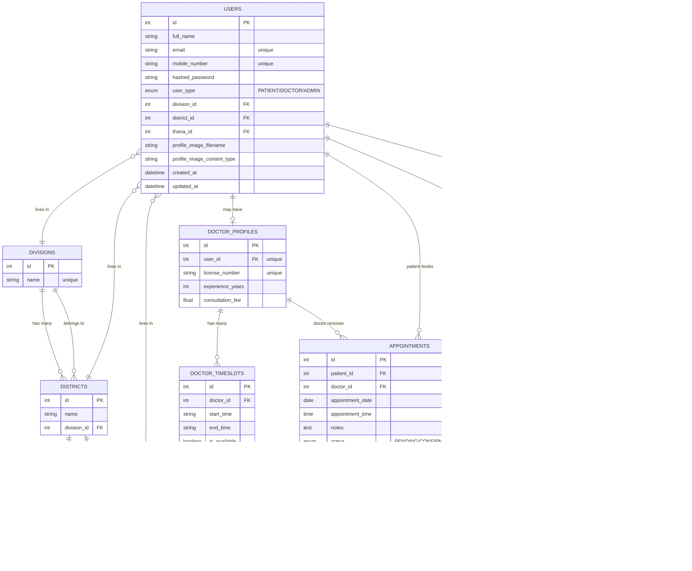

# Database Models Flowchart

This document shows the structure and relationships between all tables in the appointment system database.

## Entity Relationship Diagram

## Table Communication Flow

### 1. Location Hierarchy

### 2. User Management Flow

### 3. Appointment Booking Flow

### 4. Authentication & Security Flow

## Key Relationships Summary

### One-to-Many Relationships:
- **Division** → **Districts** (1:N)
- **District** → **Thanas** (1:N)
- **User** → **Appointments** as Patient (1:N)
- **DoctorProfile** → **Appointments** as Doctor (1:N)
- **DoctorProfile** → **DoctorTimeslots** (1:N)
- **User** → **Notifications** (1:N)
- **User** → **TokenBlacklist** (1:N)

### One-to-One Relationships:
- **User** → **DoctorProfile** (1:1, optional for doctors only)

### Many-to-One Relationships:
- **User** → **Division/District/Thana** (N:1 for address)

## Data Flow Scenarios

### 1. Doctor Registration:
1. User registers with type "DOCTOR"
2. DoctorProfile is created linked to User
3. Doctor sets up available timeslots
4. Doctor becomes available for appointments

### 2. Patient Booking:
1. Patient searches for doctors
2. Patient views available timeslots
3. Patient books appointment
4. Appointment record created
5. Notification sent to both doctor and patient

### 3. Location-based Search:
1. Filter users by Division → District → Thana
2. Find doctors in specific locations
3. Show relevant appointment options

This structure ensures data integrity and efficient querying while maintaining clear separation of concerns between different system components.

## Interactive System Flow Diagram

```mermaid
graph LR
    %% User Journey
    START([🚀 System Start]) --> REG{👤 User Registration}

    REG -->|Patient| PAT[🤒 Patient Dashboard]
    REG -->|Doctor| DOC[👨‍⚕️ Doctor Setup]
    REG -->|Admin| ADM[⚙️ Admin Panel]

    %% Doctor Flow
    DOC --> DOCPROF[📋 Create Doctor Profile]
    DOCPROF --> SCHEDULE[⏰ Set Time Slots]
    SCHEDULE --> DOCREADY[✅ Doctor Available]

    %% Patient Flow
    PAT --> SEARCH[🔍 Search Doctors]
    SEARCH --> FILTER[📍 Filter by Location]
    FILTER --> VIEWDOC[👁️ View Doctor Details]
    VIEWDOC --> CHECKTIME[⏰ Check Available Times]
    CHECKTIME --> BOOK[📅 Book Appointment]

    %% Appointment Flow
    BOOK --> CREATEAPPT[➕ Create Appointment]
    CREATEAPPT --> NOTIFY1[🔔 Notify Doctor]
    CREATEAPPT --> NOTIFY2[🔔 Notify Patient]

    DOCREADY --> VIEWAPPT[📋 View Appointments]
    VIEWAPPT --> CONFIRM{✅ Confirm?}
    CONFIRM -->|Yes| APPROVED[✅ Confirmed]
    CONFIRM -->|No| REJECTED[❌ Cancelled]

    APPROVED --> NOTIFYCONF[🔔 Notify Patient]
    REJECTED --> NOTIFYREJ[🔔 Notify Rejection]

    %% Admin Flow
    ADM --> MANAGE[👥 Manage Users]
    MANAGE --> REPORTS[📊 Generate Reports]

    %% Security Flow
    REG --> AUTH[🔐 Authentication]
    AUTH --> JWT[🎫 JWT Token]
    JWT --> ACTIONS[⚡ User Actions]
    ACTIONS --> LOGOUT{🚪 Logout?}
    LOGOUT -->|Yes| BLACKLIST[🚫 Blacklist Token]
    LOGOUT -->|No| ACTIONS

    %% Styling
    classDef startStyle fill:#4caf50,stroke:#2e7d32,stroke-width:3px,color:white
    classDef userStyle fill:#2196f3,stroke:#1565c0,stroke-width:2px,color:white
    classDef doctorStyle fill:#ff9800,stroke:#ef6c00,stroke-width:2px,color:white
    classDef appointmentStyle fill:#e91e63,stroke:#ad1457,stroke-width:2px,color:white
    classDef securityStyle fill:#9c27b0,stroke:#6a1b9a,stroke-width:2px,color:white

    class START startStyle
    class REG,PAT,SEARCH,FILTER,VIEWDOC userStyle
    class DOC,DOCPROF,SCHEDULE,DOCREADY,VIEWAPPT doctorStyle
    class BOOK,CREATEAPPT,CHECKTIME,APPROVED,REJECTED appointmentStyle
    class AUTH,JWT,BLACKLIST securityStyle
```

