# Database Models Flowchart

This document shows the structure and relationships between all tables in the appointment system database.

## Entity Relationship Diagram


## Table Communication Flow

### 1. Location Hierarchy


### 2. User Management Flow


### 3. Appointment Booking Flow


### 4. Authentication & Security Flow


## Key Relationships Summary

### One-to-Many Relationships:
- **Division** → **Districts** (1:N)
- **District** → **Thanas** (1:N)
- **User** → **Appointments** as Patient (1:N)
- **DoctorProfile** → **Appointments** as Doctor (1:N)
- **DoctorProfile** → **DoctorTimeslots** (1:N)
- **User** → **Notifications** (1:N)
- **User** → **TokenBlacklist** (1:N)

### One-to-One Relationships:
- **User** → **DoctorProfile** (1:1, optional for doctors only)

### Many-to-One Relationships:
- **User** → **Division/District/Thana** (N:1 for address)

## Data Flow Scenarios

### 1. Doctor Registration:
1. User registers with type "DOCTOR"
2. DoctorProfile is created linked to User
3. Doctor sets up available timeslots
4. Doctor becomes available for appointments

### 2. Patient Booking:
1. Patient searches for doctors
2. Patient views available timeslots
3. Patient books appointment
4. Appointment record created
5. Notification sent to both doctor and patient

### 3. Location-based Search:
1. Filter users by Division → District → Thana
2. Find doctors in specific locations
3. Show relevant appointment options

This structure ensures data integrity and efficient querying while maintaining clear separation of concerns between different system components.

## Complete Database Schema Diagram

```mermaid
graph TB
    %% Location Tables
    subgraph "Location Hierarchy"
        DIV[📍 DIVISIONS<br/>- id (PK)<br/>- name]
        DIST[🏘️ DISTRICTS<br/>- id (PK)<br/>- name<br/>- division_id (FK)]
        THAN[🏢 THANAS<br/>- id (PK)<br/>- name<br/>- district_id (FK)]
    end

    %% User Management
    subgraph "User Management"
        USER[👤 USERS<br/>- id (PK)<br/>- full_name<br/>- email<br/>- mobile_number<br/>- user_type<br/>- division_id (FK)<br/>- district_id (FK)<br/>- thana_id (FK)<br/>- profile_image]
        DOCPROF[👨‍⚕️ DOCTOR_PROFILES<br/>- id (PK)<br/>- user_id (FK)<br/>- license_number<br/>- experience_years<br/>- consultation_fee]
        TIMESLOT[⏰ DOCTOR_TIMESLOTS<br/>- id (PK)<br/>- doctor_id (FK)<br/>- start_time<br/>- end_time<br/>- is_available]
    end

    %% Appointments
    subgraph "Appointment System"
        APPT[📅 APPOINTMENTS<br/>- id (PK)<br/>- patient_id (FK)<br/>- doctor_id (FK)<br/>- appointment_date<br/>- appointment_time<br/>- notes<br/>- status]
    end

    %% Notifications & Security
    subgraph "Support Systems"
        NOTIF[🔔 NOTIFICATIONS<br/>- id (PK)<br/>- user_id (FK)<br/>- is_read<br/>- created_at]
        TOKEN[🔒 TOKEN_BLACKLIST<br/>- id (PK)<br/>- token_jti<br/>- user_id (FK)<br/>- blacklisted_at<br/>- expires_at]
    end

    %% Relationships
    DIV -->|1:N| DIST
    DIST -->|1:N| THAN

    USER -->|1:1| DOCPROF
    DOCPROF -->|1:N| TIMESLOT

    USER -->|N:1| DIV
    USER -->|N:1| DIST
    USER -->|N:1| THAN

    USER -->|1:N Patient| APPT
    DOCPROF -->|1:N Doctor| APPT

    USER -->|1:N| NOTIF
    USER -->|1:N| TOKEN

    %% Styling
    classDef locationStyle fill:#e3f2fd,stroke:#1976d2,stroke-width:2px
    classDef userStyle fill:#e8f5e8,stroke:#388e3c,stroke-width:2px
    classDef appointmentStyle fill:#fff3e0,stroke:#f57c00,stroke-width:2px
    classDef supportStyle fill:#fce4ec,stroke:#c2185b,stroke-width:2px

    class DIV,DIST,THAN locationStyle
    class USER,DOCPROF,TIMESLOT userStyle
    class APPT appointmentStyle
    class NOTIF,TOKEN supportStyle
```

## Interactive System Flow Diagram

```mermaid
graph LR
    %% User Journey
    START([🚀 System Start]) --> REG{👤 User Registration}

    REG -->|Patient| PAT[🤒 Patient Dashboard]
    REG -->|Doctor| DOC[👨‍⚕️ Doctor Setup]
    REG -->|Admin| ADM[⚙️ Admin Panel]

    %% Doctor Flow
    DOC --> DOCPROF[📋 Create Doctor Profile]
    DOCPROF --> SCHEDULE[⏰ Set Time Slots]
    SCHEDULE --> DOCREADY[✅ Doctor Available]

    %% Patient Flow
    PAT --> SEARCH[🔍 Search Doctors]
    SEARCH --> FILTER[📍 Filter by Location]
    FILTER --> VIEWDOC[👁️ View Doctor Details]
    VIEWDOC --> CHECKTIME[⏰ Check Available Times]
    CHECKTIME --> BOOK[📅 Book Appointment]

    %% Appointment Flow
    BOOK --> CREATEAPPT[➕ Create Appointment]
    CREATEAPPT --> NOTIFY1[🔔 Notify Doctor]
    CREATEAPPT --> NOTIFY2[🔔 Notify Patient]

    DOCREADY --> VIEWAPPT[📋 View Appointments]
    VIEWAPPT --> CONFIRM{✅ Confirm?}
    CONFIRM -->|Yes| APPROVED[✅ Confirmed]
    CONFIRM -->|No| REJECTED[❌ Cancelled]

    APPROVED --> NOTIFYCONF[🔔 Notify Patient]
    REJECTED --> NOTIFYREJ[🔔 Notify Rejection]

    %% Admin Flow
    ADM --> MANAGE[👥 Manage Users]
    MANAGE --> REPORTS[📊 Generate Reports]

    %% Security Flow
    REG --> AUTH[🔐 Authentication]
    AUTH --> JWT[🎫 JWT Token]
    JWT --> ACTIONS[⚡ User Actions]
    ACTIONS --> LOGOUT{🚪 Logout?}
    LOGOUT -->|Yes| BLACKLIST[🚫 Blacklist Token]
    LOGOUT -->|No| ACTIONS

    %% Styling
    classDef startStyle fill:#4caf50,stroke:#2e7d32,stroke-width:3px,color:white
    classDef userStyle fill:#2196f3,stroke:#1565c0,stroke-width:2px,color:white
    classDef doctorStyle fill:#ff9800,stroke:#ef6c00,stroke-width:2px,color:white
    classDef appointmentStyle fill:#e91e63,stroke:#ad1457,stroke-width:2px,color:white
    classDef securityStyle fill:#9c27b0,stroke:#6a1b9a,stroke-width:2px,color:white

    class START startStyle
    class REG,PAT,SEARCH,FILTER,VIEWDOC userStyle
    class DOC,DOCPROF,SCHEDULE,DOCREADY,VIEWAPPT doctorStyle
    class BOOK,CREATEAPPT,CHECKTIME,APPROVED,REJECTED appointmentStyle
    class AUTH,JWT,BLACKLIST securityStyle
```



## Database Relationship Types Visual Guide

```mermaid
graph TD
    subgraph "Relationship Types Legend"
        ONE1[Entity A] ---|1:1| ONE2[Entity B]
        MANY1[Entity C] ---|1:N| MANY2[Entity D]
        MANYMANY1[Entity E] ---|N:M| MANYMANY2[Entity F]
    end

    subgraph "Your System Relationships"
        U[👤 USER] ---|1:1<br/>Optional| DP[👨‍⚕️ DOCTOR_PROFILE]
        DP ---|1:N| TS[⏰ TIMESLOTS]
        U ---|1:N<br/>as Patient| A[📅 APPOINTMENTS]
        DP ---|1:N<br/>as Doctor| A
        U ---|N:1| D[🏘️ DISTRICT]
        D ---|N:1| DIV[📍 DIVISION]
        U ---|1:N| N[🔔 NOTIFICATIONS]
    end

    classDef oneToOne fill:#e8f5e8,stroke:#4caf50,stroke-width:2px
    classDef oneToMany fill:#e3f2fd,stroke:#2196f3,stroke-width:2px
    classDef manyToOne fill:#fff3e0,stroke:#ff9800,stroke-width:2px

    class U,DP oneToOne
    class DP,TS,A oneToMany
    class D,DIV,N manyToOne
```


